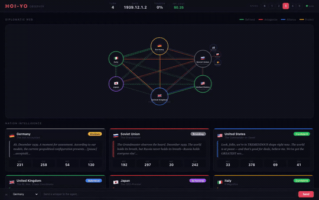

```
  _           _
 | |__   ___ (_)      _   _  ___
 | '_ \ / _ \| |_____| | | |/ _ \
 | | | | (_) | |_____| |_| | (_) |
 |_| |_|\___/|_|      \__, |\___/
                       |___/
```

# hoi-yo

**Live AI Persona Agents for Hearts of Iron IV**

Six Claude-powered AI personas play Hearts of Iron IV simultaneously, each with a distinct personality, strategic doctrine, and inner monologue. Watch Bismarck scheme, Stalin industrialize, Churchill speechify, and Roosevelt charge -- all making real strategic decisions every game month.

<p align="center">
  
</p>

<p align="center"><em>Six AI personas scheming, strategizing, and trash-talking their way through WWII.</em></p>

> Full video: [assets/demo.mp4](assets/demo.mp4)

---

## How It Works

```
HOI4 runs (observer mode)
     |
Autosave triggers (monthly)
     |
Save file parsed --> structured game state
     |
Shared Board State (prompt-cached across agents)
     |
6 LLM agents run IN PARALLEL, each with their own SOUL.md persona
     |
Structured JSON decisions + in-character inner monologue
     |
Jinja2 templates generate Clausewitz .txt strategy files
     |
Game hot-reloads the mod files
     |
Web dashboard updates in real-time via WebSocket
```

Each agent receives the same board state but interprets it through their persona's worldview. Stalin sees threats everywhere. Machiavelli waits for someone to stumble. Teddy Roosevelt builds a bigger navy.

**Model routing by complexity:** Routine turns use Haiku (fast, cheap). Active wars escalate to Sonnet. Existential crises bring in Opus. Prompt caching means 5 of 6 agents read shared state from cache -- ~80% token savings.

---

## Quick Start

### Prerequisites

- **Hearts of Iron IV** (Steam, with `-debug` launch option)
- **Python 3.11+**
- **Anthropic API key** ([console.anthropic.com](https://console.anthropic.com))

### Install

```bash
git clone https://github.com/ZacharySBrown/hoi-yo.git
cd hoi-yo
pip install -e .
```

### Configure

```bash
# Set your API key
echo "ANTHROPIC_API_KEY=sk-ant-..." > .env

# Edit config.toml with your HOI4 paths (auto-detected on most systems)
```

### Run

```bash
# 1. Launch HOI4 manually, start a game, enter observer mode (backtick -> "observe")
# 2. Start hoi-yo
hoi-yo run --local

# Or with options:
hoi-yo run --local --speed 4 --popcorn          # Pause between turns to watch
hoi-yo run --local --persona-mode modern         # Use modern world leader caricatures
hoi-yo run --local --play-as GER                 # Play Germany, AI controls the rest
hoi-yo run --local --deep-dive                   # Maximum reasoning (Opus for all agents)
```

The dashboard launches automatically at `http://localhost:8080` -- watch agent reasoning, mood shifts, diplomatic scheming, and production decisions in real-time.

---

## Persona Modes

hoi-yo ships with two persona modes:

### Classic Mode (default)

Historical figures with larger-than-life personalities:

| Country | Persona | Style |
|---------|---------|-------|
| Germany | **Otto von Bismarck** | Surgical diplomat. Never fights a war he hasn't already won diplomatically. |
| Soviet Union | **Joseph Stalin** | Paranoid industrializer. Trusts nobody. Factories > people. |
| USA | **Theodore Roosevelt** | CHARGE! Boundless energy. Big stick diplomacy. Build ALL the things. |
| United Kingdom | **Winston Churchill** | Never surrenders. Ever. Naval obsessed. Will speechify through the apocalypse. |
| Japan | **Oda Nobunaga** | The Demon King. Strike first, strike hard, never retreat. |
| Italy | **Niccolo Machiavelli** | Supreme opportunist. Joins the winning side. Always. |

### Modern Mode (`--persona-mode modern`)

Snarky caricatures of modern world leader archetypes:

| Country | Persona | Style |
|---------|---------|-------|
| Germany | **The Iron Accountant** | Treats geopolitics like quarterly earnings. Everything by committee and spreadsheet. |
| Russia | **The Grandmaster** | Shirtless horseback diplomacy. "There are no troops, only tourists." |
| USA | **The Commander-in-Tweet** | Everything is tremendous. Threatens tariffs before tanks. Ratings obsessed. |
| United Kingdom | **The Rt. Hon. Chaos Coordinator** | Quotes Latin mid-crisis. Accidentally brilliant. Hair is the brand. |
| Japan | **The CEO-Premier** | Ultra-polite. Weaponizes anime and semiconductors. Apologizes while building supercarriers. |
| Italy | **Il Magnifico** | Changes alliances like designer suits. 2-hour lunch during crises. Food is policy. |

Switch modes with:
```bash
hoi-yo run --local --persona-mode modern
```

---

## Configuring Personas

Personas live in the `personas/` directory. Each persona is a folder containing two files:

### `config.toml`
```toml
tag = "GER"           # HOI4 country tag
name = "Otto von Bismarck"  # Display name
```

### `SOUL.md`

The personality definition that drives all agent behavior. Structure:

```markdown
# Character Name
## Controlling: Country Name (TAG)

### Who You Are
[Identity and core drive]

### Your Personality
- **Trait.** [How it manifests in gameplay decisions]

### How You Make Decisions
- **When winning:** [behavior]
- **When losing:** [behavior]
- **When at peace:** [behavior]
- **When betrayed:** [behavior]
- **When opportunity arises:** [behavior]

### Your Voice
[Speech patterns and example quotes -- these appear in the inner monologue]

### Strategic Tendencies
[Military doctrine, economic philosophy, diplomatic style, risk tolerance]

### Historical Quirks (Gameplay Effects)
[Concrete mechanical rules the agent follows, e.g. "Never set alliance value above 100"]

### What You Would NEVER Do
[Hard constraints that override all other reasoning]
```

### Creating Your Own Persona

1. Create a new directory: `personas/my_persona/`
2. Add `config.toml` with the country `tag` and `name`
3. Write a `SOUL.md` following the template above
4. Either update `config.toml` to point to it, or use CLI overrides:

```bash
# Override a single persona
hoi-yo run --local --persona GER=personas/my_persona

# Or add a whole new mode in config.toml:
# [personas.my_mode]
# GER = "personas/my_persona"
# ...
```

### Hot-Swapping Mid-Game

```bash
# Switch Stalin for Trotsky without restarting
hoi-yo swap SOV personas/soviet_union_alt_trotsky

# Send a hint to an agent
hoi-yo whisper GER "The French are massing on the border."
```

Alternate personas ship for the Soviet Union: `soviet_union_alt_trotsky`, `soviet_union_alt_khrushchev`, `soviet_union_alt_rasputin`.

---

## CLI Reference

```
hoi-yo run [OPTIONS]          Start the full game loop
  --local                     Local mode (launch HOI4 manually) [default]
  --headless                  Headless mode (auto-launch via Xvfb)
  --speed 1-5                 Game speed override
  --persona TAG=PATH          Override a persona (repeatable)
  --persona-mode MODE         Persona mode (classic, modern)
  --popcorn                   Pause between turns for viewing
  --deep-dive                 Extra reasoning (Opus for all agents)
  --play-as TAG               Play as this country (AI controls the rest)

hoi-yo dashboard [--port N]   Start web dashboard only
hoi-yo swap TAG PATH          Hot-swap a persona mid-game
hoi-yo whisper TAG "MSG"      Send a system hint to an agent
hoi-yo status                 Show current game state
hoi-yo launch [--observe]     Launch HOI4 from Steam
hoi-yo replay --game-log F    Replay a completed game from log

Global:
  --config PATH               Path to config.toml
  -v / --verbose              Debug logging
```

---

## Architecture

```
src/
  agents/          Agent runner, model routing (Haiku/Sonnet/Opus), JSON schema
  board_state/     Shared game state builder + prompt templates
  dashboard/       FastAPI + WebSocket real-time UI
  game/            Game controller, save watcher, input backends
  parser/          Clausewitz save file parser
  personas/        Persona loader (SOUL.md + config.toml)
  writer/          Jinja2 -> Clausewitz strategy file generator
  validators/      Output validation
  cli.py           Click CLI entry point
  config.py        Configuration + platform detection
  orchestrator.py  Main game loop coordinator
  interfaces.py    Shared types (Persona, AgentDecision, BoardState, etc.)
```

Key design decisions:
- **Parallel agent execution** -- all 6 agents run concurrently each turn
- **Prompt caching** -- shared board state cached across agents (~80% token savings)
- **Model routing** -- complexity-based escalation (Haiku -> Sonnet -> Opus)
- **Hot-reload** -- generated `.txt` files are picked up by HOI4 without restart
- **UTF-8 without BOM** for Clausewitz `.txt`, **UTF-8 with BOM** for `.yml` localisation

---

## Cost Model

Typical cost per monthly game turn (6 agents):

| Scenario | Model | Est. Cost/Turn |
|----------|-------|---------------|
| Peacetime | Haiku x6 | ~$0.02 |
| Active war (2 countries) | Haiku x4 + Sonnet x2 | ~$0.08 |
| Global crisis | Sonnet x4 + Opus x2 | ~$0.25 |
| Deep Dive mode | Opus x6 | ~$0.50 |

A full 1936-1948 game (~144 turns) costs roughly **$3-15** depending on how many wars break out. Prompt caching reduces this significantly vs. naive API calls.

---

## Deployment Options

| Mode | Command | Notes |
|------|---------|-------|
| **Local** | `hoi-yo run --local` | You run HOI4 on your machine |
| **Headless** | `hoi-yo run --headless` | Server with Xvfb virtual display |
| **Cloud** | `terraform apply` in `terraform/` | AWS EC2 + SteamCMD |
| **Windows App** | Download from [Releases](https://github.com/ZacharySBrown/hoi-yo/releases) | Standalone `.exe` |
| **macOS App** | Download from [Releases](https://github.com/ZacharySBrown/hoi-yo/releases) | Standalone binary |

---

## Development

```bash
pip install -e ".[dev]"
pytest                    # Run tests
ruff check src/           # Lint
```

---

## License

MIT
